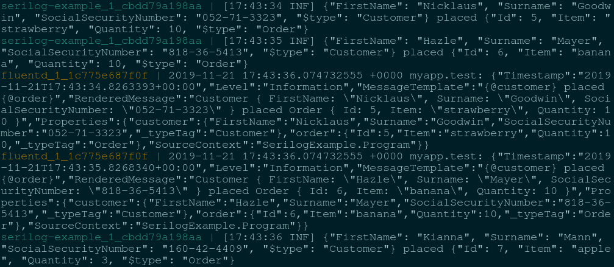

# Serilog and Fluentd

## Introduction

[Fluentd](https://www.fluentd.org/) is an open source data collector providing a unified logging layer. [Serilog](https://serilog.net/) is fantastic at producing structured log events. This repository provides a sandbox where developers can explore the life of a log event starting with its birth in Serilog, its transport over the network using HTTP, and finally being collected and processed by Fluentd.

## What you will end up with



With a running Fluentd server and Serilog producing log events you are now ready to take it to the next level. If you fancy the producing part you'll dig deeper into Serilog and its configuration of log contexts, enrichers and message formatters. If you enjoy configuring data collectors you'll explore Fluentd with its inputs, filters and outputs.

## Requirements

- [Docker](https://www.docker.com/community-edition#/download)
- [Docker Compose](https://docs.docker.com/compose/install)

## Usage

Start two services, one producing log events and one consuming them, with the following command.

```posh
docker compose up
```
